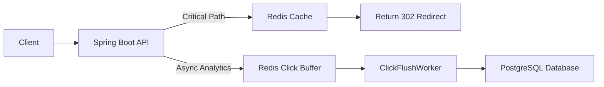

# 🚀 Production-Grade URL Shortener (Spring Boot)

A **scalable URL shortener service** built using **Spring Boot, Redis, and PostgreSQL**, designed to demonstrate **real-world system design patterns used in production systems**.

This project focuses on **performance, resilience, and scalability**, not just basic CRUD functionality.

---

# 🎯 Goals

This project demonstrates several **production-grade backend design patterns**:

- Critical vs Non-Critical path separation
- Cache-first redirect architecture
- Hot key optimization using Redis
- Async analytics processing
- Cache stampede protection (request coalescing)
- Bulkhead isolation for redirect path
- Eventual consistency for analytics data
- Monitoring-ready architecture

---

# 🏗 Architecture Overview



---

# ⚡ Critical Path (Redirect Flow)

The redirect path must be **fast and resilient**.

### Flow

1. Client requests `/shortCode`
2. Application checks **Redis Cache**
3. If found → return **HTTP 302 redirect**
4. If not found → fetch from **PostgreSQL**
5. Store result in **Redis cache**
6. Return redirect

### Resilience Features

**Bulkhead Isolation**

- Implemented using **Resilience4j**
- Limits concurrent redirect operations
- Prevents thread pool exhaustion

**Cache-First Reads**

- Redis acts as the primary read layer

**Cache Stampede Protection**

- Redis locking prevents multiple threads hitting the database simultaneously

---

# 📊 Non-Critical Path (Analytics Flow)

Click tracking is handled **asynchronously** to avoid slowing down redirects.

### Flow

1. Redirect happens instantly
2. Click count incremented asynchronously
3. Redis stores counters as:

```
click:<shortCode>
```

4. **Scheduled worker** runs every **30 seconds**
5. Worker flushes Redis counts → PostgreSQL
6. Redis counters are cleared

### Benefits

- No impact on redirect latency
- Handles traffic spikes
- Uses eventual consistency

---

# 🛠 Tech Stack

| Layer | Technology |
|------|------|
| Backend | Spring Boot 3 |
| ORM | JPA / Hibernate |
| Database | PostgreSQL |
| Cache | Redis |
| Concurrency | Resilience4j Bulkhead |
| Async Processing | Spring `@Async` |
| Scheduler | Spring `@Scheduled` |
| Containerization | Docker |

---

# 🔥 Key Features

| Feature | Implementation |
|------|------|
| Bulkhead Isolation | `@Bulkhead` using Resilience4j |
| Cache-First Redirect | Redis stores `shortCode → originalUrl` |
| Cache Stampede Protection | Redis locking for request coalescing |
| Async Click Tracking | `@Async` Redis increment |
| Click Flush Worker | Scheduled job updates database |
| Eventual Consistency | Redis counters periodically persisted to DB |

---

# 🗄 Database Schema

### Table: `urls`

| Column | Type | Notes |
|------|------|------|
| id | bigint (PK) | Auto increment |
| short_code | varchar(10) | Unique index |
| original_url | varchar(2048) | Not null |
| created_at | timestamp | Not null |
| expires_at | timestamp | Optional |
| click_count | bigint | Default 0 |

---

# 🚀 Setup Instructions

## 1️⃣ Clone the Repository

```bash
git clone https://github.com/<your-username>/url-shortener.git
cd url-shortener
```

---

## 2️⃣ Start Dependencies (Docker)

```bash
docker-compose up -d
```

Services started:

| Service | Port |
|------|------|
| PostgreSQL | 5432 |
| Redis | 6379 |

---

## 3️⃣ Configure `application.yml`

```yaml
spring:
  datasource:
    url: jdbc:postgresql://localhost:5432/urlshortener
    username: postgres
    password: postgres

  redis:
    host: localhost
    port: 6379
```

---

## 4️⃣ Run Spring Boot

Using Maven Wrapper:

```bash
./mvnw spring-boot:run
```

Or using Maven:

```bash
mvn spring-boot:run
```

---

# 🌐 API Endpoints

| Method | Endpoint | Description |
|------|------|------|
| POST | `/shorten?url=LONG_URL` | Create a short URL |
| GET | `/{shortCode}` | Redirect to original URL |
| GET | `/` | List all URLs (admin endpoint) |

---

# 🧠 Design Considerations

### Critical Path

- Optimized for **low latency**
- Protected with **Bulkhead pattern**
- Uses **Redis cache-first strategy**
- Request coalescing prevents database overload

### Non-Critical Path

- Click analytics processed **asynchronously**
- Redis used as a **temporary buffer**
- Scheduled worker ensures **eventual consistency**

---

## Observability (Prometheus + Micrometer)

The system exposes metrics via Spring Boot Actuator and Prometheus.

Metrics include:

redirect_requests_total
cache_hits_total
cache_misses_total
redirect_latency_seconds
redis_command_latency
db_query_latency
worker_execution_latency

Metrics endpoint:

http://localhost:8080/actuator/prometheus

---

# 🏗 Future Improvements

Possible production upgrades:

- Rate limiting per IP using Redis
- Distributed locking with Redisson
- Kafka / RabbitMQ for multi-instance analytics processing
- Prometheus + Grafana monitoring
- Circuit breakers for DB and cache calls
- PostgreSQL read replicas

---

# 📚 References

- Spring Boot Documentation
- Resilience4j
- Redis Documentation
- PostgreSQL Documentation
- Docker Documentation

---

# 📌 Project Purpose

This project demonstrates **real-world backend engineering patterns**, including:

- High-performance redirect systems
- Cache-first architectures
- Async analytics pipelines
- Fault isolation patterns
- Eventual consistency models

---

## ✅ Commit Changes

```bash
git add README.md
git commit -m "Add production-grade README with architecture and design explanation"
git push
```
